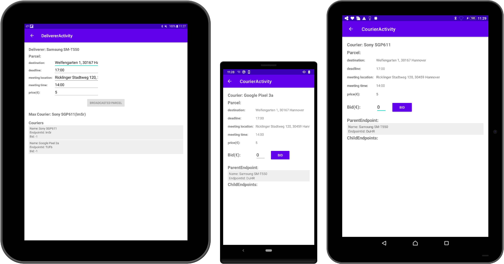

# NearbyCrowdshipping - Mobile ad hoc network for Crowdshipping system

## Description
For the bachelor thesis in 6th semester I had to come up with an idea to decentralize an existing Crowdshipping system and implement this idea with a small android app. I have no prior experience with mobile android development before so the implementation might not follow the best practices.

The main idea is to create an ad hoc mobile network for the crowd in a restricted area. Participants in this network can create or transfer a task to other participants without relying on any existing infrastructure. For this offline peer-to-peer communications is Google Nearby Connections API used.

## Screenshots

